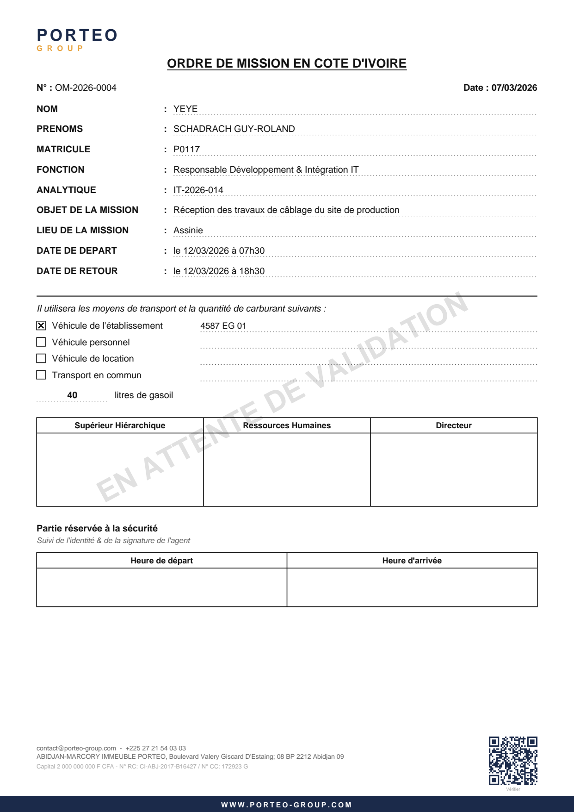

# Ordres de mission — PORTEO GROUP

Dématérialisation des **ordres de mission en Côte d'Ivoire** de PORTEO GROUP.

Un collaborateur saisit sa demande en ligne ; l'application produit un PDF
visuellement fidèle au formulaire papier pré-imprimé et l'envoie par e-mail
aux Ressources Humaines, qui valident ou refusent **directement depuis leur
boîte mail**, sans avoir à se connecter.

L'ensemble tient dans les quotas gratuits de Vercel, Neon et Resend.



Le document ci-dessus est généré par l'application. Un ordre refusé porte un
filigrane rouge et le motif du refus (`docs/apercu-pdf-refuse.png`) ; un ordre
en attente porte un filigrane gris « EN ATTENTE DE VALIDATION ».

---

## Sommaire

1. [Fonctionnement](#fonctionnement)
2. [Pile technique](#pile-technique)
3. [Prérequis](#prérequis)
4. [Installation locale](#installation-locale)
5. [Création de la base Neon](#création-de-la-base-neon)
6. [Configuration de Resend](#configuration-de-resend)
7. [Variables d'environnement](#variables-denvironnement)
8. [Commandes](#commandes)
9. [Tests](#tests)
10. [Déploiement sur Vercel](#déploiement-sur-vercel)
11. [Limites de l'offre gratuite](#limites-de-loffre-gratuite)
12. [Architecture du code](#architecture-du-code)
13. [Décisions de conception](#décisions-de-conception)
14. [Recette](#recette)

---

## Fonctionnement

```
Collaborateur                    Application                  Ressources Humaines
     │                                │                                │
     │ saisit sa demande              │                                │
     ├───────────────────────────────►│                                │
     │                                │ attribue OM-2026-0001          │
     │                                │ émet 2 jetons à usage unique   │
     │                                │ produit le PDF                 │
     │                                ├───────────────────────────────►│
     │                                │   e-mail + PDF joint           │
     │                                │   ✓ Valider    ✗ Refuser       │
     │                                │                                │
     │                                │◄───────────────────────────────┤
     │                                │   décision (sans connexion)    │
     │◄───────────────────────────────┤                                │
     │  e-mail : validé (PDF joint)   │                                │
     │  ou refusé (motif)             │                                │
```

Le PDF porte un **QR code** renvoyant vers `/verify/{numero}` : n'importe qui —
un agent au poste de garde, par exemple — peut vérifier l'authenticité d'un
document présenté, sans accéder à la moindre donnée personnelle sensible.

### Statuts

| Statut      | Signification                          | Transitions possibles                   |
| ----------- | -------------------------------------- | --------------------------------------- |
| `DRAFT`     | Brouillon, non soumis, non numéroté    | modifier, supprimer, soumettre, annuler |
| `SUBMITTED` | Envoyé aux RH, en attente              | valider, refuser, annuler, renvoyer     |
| `APPROVED`  | Validé par les RH                      | — (terminal)                            |
| `REJECTED`  | Refusé, motif obligatoire              | — (terminal)                            |
| `CANCELLED` | Annulé par le demandeur avant décision | — (terminal)                            |

### Rôles

| Rôle       | Périmètre                                           |
| ---------- | --------------------------------------------------- |
| `EMPLOYEE` | Ses propres ordres de mission uniquement            |
| `HR`       | Vue globale, décisions, export CSV                  |
| `ADMIN`    | Idem `HR`, plus l'administration des collaborateurs |

---

## Pile technique

| Couche           | Choix                                                          |
| ---------------- | -------------------------------------------------------------- |
| Framework        | Next.js 15 — App Router, Server Actions, TypeScript strict     |
| Interface        | Tailwind CSS v4, composants shadcn/ui, lucide-react            |
| Formulaires      | react-hook-form + zod + @hookform/resolvers                    |
| ORM              | Prisma 6, adaptateur `@prisma/adapter-neon`                    |
| Base             | Neon Postgres                                                  |
| Authentification | Auth.js v5 — lien magique par e-mail uniquement                |
| E-mail           | Resend + React Email                                           |
| PDF              | `@react-pdf/renderer` (runtime Node, ni Puppeteer ni Chromium) |
| Tests            | Vitest (unitaires) et Playwright (bout en bout)                |
| Fuseau           | `Africa/Abidjan` — stockage en UTC, affichage en heure locale  |
| Langue           | Français intégral : interface, e-mails, PDF, messages d'erreur |

---

## Prérequis

- **Node.js 20 ou supérieur** (`node -v`)
- **pnpm 9** — `corepack enable && corepack prepare pnpm@9.15.4 --activate`
- Un compte **Neon** (offre gratuite) pour la base de données
- Un compte **Resend** (offre gratuite) pour l'envoi d'e-mails
- Un compte **Vercel** (offre Hobby) pour l'hébergement

Pour développer sans Neon, un PostgreSQL 14+ local suffit : l'application
détecte l'hôte et n'active l'adaptateur Neon que sur une chaîne `*.neon.tech`.

---

## Installation locale

```bash
git clone <url-du-dépôt> ordremission
cd ordremission

corepack enable
pnpm install

cp .env.example .env
openssl rand -base64 32          # valeur à placer dans AUTH_SECRET

pnpm db:deploy                   # applique les migrations
pnpm db:seed                     # jeu de données de démonstration
pnpm dev                         # http://localhost:3000
```

Quatre variables suffisent pour un essai en local — Resend n'est pas
nécessaire :

```dotenv
DATABASE_URL="postgresql://postgres@127.0.0.1:5432/ordremission"
DIRECT_URL="postgresql://postgres@127.0.0.1:5432/ordremission"
AUTH_SECRET="<sortie de openssl rand -base64 32>"
EMAIL_TRANSPORT="file"
```

### Se connecter en local sans envoyer de vrais e-mails

Avec `EMAIL_TRANSPORT="file"`, les messages sont écrits dans `.mailbox/` au
lieu d'être envoyés. La commande `pnpm lien` en extrait les liens :

```bash
pnpm lien              # dernier message : destinataires, objet, pièces jointes, liens
pnpm lien connexion    # dernier lien de connexion, seul
pnpm lien approve      # dernier lien de validation RH
pnpm lien reject       # dernier lien de refus RH
```

Le PDF joint n'est pas écrit sur disque par ce transport ; pour l'examiner,
téléchargez-le depuis l'écran de détail ou lancez `pnpm pdf:exemples`.

Comptes du jeu de démonstration :

| Adresse                           | Rôle                           |
| --------------------------------- | ------------------------------ |
| `schadrach.yeye@porteo-group.com` | Collaborateur (matricule 4071) |
| `rh@porteo-group.com`             | Ressources Humaines            |
| `admin@porteo-group.com`          | Administrateur                 |

### Logo

Déposez le logo officiel dans `public/porteo-logo.png` (PNG, environ
360 × 130 px). En son absence, le PDF et l'interface utilisent un bloc
typographique de remplacement — c'est le cas sur la capture ci-dessus.

---

## Création de la base Neon

1. Créer un projet sur [neon.tech](https://neon.tech), région **Europe
   (Frankfurt)** ou **AWS eu-central-1** — la plus proche d'Abidjan parmi
   celles de l'offre gratuite.
2. Récupérer **deux** chaînes de connexion dans l'onglet _Connection Details_ :
   - la chaîne **pooled** (l'hôte contient `-pooler`) → `DATABASE_URL` ;
     c'est celle qu'utilise l'application en production.
   - la chaîne **directe** (sans `-pooler`) → `DIRECT_URL` ; elle sert
     uniquement à `prisma migrate`, qui a besoin d'une session persistante.
3. Conserver `?sslmode=require` à la fin des deux chaînes.
4. Appliquer le schéma :

```bash
pnpm db:deploy    # prisma migrate deploy
pnpm db:seed      # facultatif : jeu de démonstration
```

> Neon met les projets gratuits en veille après quelques minutes d'inactivité.
> La première requête après une mise en veille prend une à deux secondes.

---

## Configuration de Resend

1. Créer un compte sur [resend.com](https://resend.com) et générer une clé
   d'API (`RESEND_API_KEY`).
2. Ajouter le domaine **porteo-group.com** dans _Domains_.
3. Créer chez le registrar les enregistrements DNS indiqués par Resend :

   | Type  | Nom                                  | Valeur                                                     | Rôle                            |
   | ----- | ------------------------------------ | ---------------------------------------------------------- | ------------------------------- |
   | `TXT` | `send.porteo-group.com`              | `v=spf1 include:amazonses.com ~all`                        | SPF — autorise Resend à émettre |
   | `TXT` | `resend._domainkey.porteo-group.com` | clé publique fournie par Resend                            | DKIM — signature des messages   |
   | `MX`  | `send.porteo-group.com`              | `feedback-smtp.<région>.amazonses.com` (priorité 10)       | retours et plaintes             |
   | `TXT` | `_dmarc.porteo-group.com`            | `v=DMARC1; p=none; rua=mailto:postmaster@porteo-group.com` | DMARC — recommandé              |

   Les valeurs exactes sont affichées dans l'interface Resend : **les recopier
   telles quelles**, elles varient d'un domaine à l'autre.

4. Attendre la vérification (quelques minutes à quelques heures selon le
   registrar), puis renseigner :

```
EMAIL_FROM="Ordres de mission Porteo <om@porteo-group.com>"
HR_EMAIL="rh@porteo-group.com,rh2@porteo-group.com"
```

`HR_EMAIL` accepte plusieurs adresses séparées par des virgules.

> Sans vérification DNS, Resend n'autorise l'envoi que vers l'adresse du
> propriétaire du compte : les e-mails aux RH n'arriveront pas.

---

## Variables d'environnement

Toutes sont documentées dans [`.env.example`](.env.example).

| Variable               | Rôle                                                       | Obligatoire   |
| ---------------------- | ---------------------------------------------------------- | ------------- |
| `DATABASE_URL`         | Chaîne Neon _pooled_, utilisée par l'application           | oui           |
| `DIRECT_URL`           | Chaîne Neon directe, utilisée par les migrations           | oui           |
| `AUTH_SECRET`          | Secret Auth.js — `openssl rand -base64 32`                 | oui           |
| `AUTH_URL`             | URL publique de l'application                              | en production |
| `AUTH_TRUST_HOST`      | `true` derrière le proxy Vercel                            | en production |
| `RESEND_API_KEY`       | Clé d'API Resend                                           | oui           |
| `EMAIL_FROM`           | Expéditeur des e-mails                                     | oui           |
| `HR_EMAIL`             | Destinataires RH, séparés par des virgules                 | oui           |
| `APP_URL`              | URL publique, utilisée dans les liens et le QR code        | oui           |
| `NEXT_PUBLIC_APP_NAME` | Titre affiché dans l'interface                             | non           |
| `EMAIL_TRANSPORT`      | `file` écrit les e-mails sur disque — **tests uniquement** | non           |

Aucun secret n'est présent dans le code ; `.env*` est exclu du dépôt.

---

## Commandes

| Commande             | Effet                                          |
| -------------------- | ---------------------------------------------- |
| `pnpm dev`           | Serveur de développement                       |
| `pnpm build`         | Build de production                            |
| `pnpm start`         | Serveur de production                          |
| `pnpm lint`          | ESLint                                         |
| `pnpm typecheck`     | Vérification TypeScript seule                  |
| `pnpm format`        | Prettier                                       |
| `pnpm test`          | Tests unitaires (Vitest)                       |
| `pnpm test:coverage` | Tests unitaires avec couverture                |
| `pnpm test:e2e`      | Tests de bout en bout (Playwright)             |
| `pnpm db:migrate`    | Crée et applique une migration (développement) |
| `pnpm db:deploy`     | Applique les migrations (production)           |
| `pnpm db:seed`       | Jeu de données de démonstration                |
| `pnpm db:studio`     | Prisma Studio                                  |
| `pnpm pdf:exemples`  | Génère des PDF d'exemple dans `pdf-exemples/`  |

---

## Tests

### Unitaires — Vitest

```bash
cp .env.test.example .env.test          # première fois
createdb ordremission_test              # base dédiée aux tests

pnpm test
pnpm test:coverage                      # seuil : 80 % sur src/lib
```

Les tests s'appuient sur une base **dédiée** décrite dans `.env.test` ; les
migrations y sont appliquées automatiquement avant la campagne, et les tables
métier sont vidées entre les suites. Ne jamais y pointer une base contenant des
données réelles.

Sont couverts :

- l'attribution des numéros, dont un test de concurrence sur **50 soumissions
  simultanées** — aucune collision, aucun trou dans la séquence ;
- chaque règle métier des validations Zod, cas passant et cas bloquant ;
- le cycle de vie des jetons : usage unique, expiration, invalidation croisée,
  et absence d'effet de bord à la simple consultation ;
- les **35 combinaisons** statut × transition de la machine à états ;
- le contrôle d'accès des requêtes, les décisions concurrentes, le rate
  limiting, le journal d'audit, l'export et l'import CSV ;
- la non-régression du PDF : une seule page, numéro présent, libellés du
  formulaire papier dans l'ordre attendu.

### Bout en bout — Playwright

```bash
cp .env.test.example .env.test          # si ce n'est pas déjà fait
pnpm exec playwright install chromium   # première fois
pnpm test:e2e
```

Playwright démarre lui-même l'application sur le port 3100 avec
`EMAIL_TRANSPORT=file`, ce qui permet de lire les e-mails — donc les liens de
connexion et de décision — sans service externe.

Scénarios : connexion par lien magique ; adresse inconnue sans fuite
d'information ; brouillon → modification → soumission → e-mail RH ; validation
depuis la boîte mail sans connexion ; refus sans puis avec motif ; rejeu d'un
lien déjà consommé.

---

## Déploiement sur Vercel

1. **Importer le dépôt** sur Vercel. Le framework Next.js est détecté seul ;
   [`vercel.json`](vercel.json) fixe la région **`cdg1` (Paris)**, la plus
   proche d'Abidjan parmi celles de l'offre Hobby.

2. **Renseigner les variables d'environnement** (section _Settings →
   Environment Variables_) pour les environnements _Production_ et _Preview_ :

   ```
   DATABASE_URL, DIRECT_URL, AUTH_SECRET, AUTH_URL, AUTH_TRUST_HOST,
   RESEND_API_KEY, EMAIL_FROM, HR_EMAIL, APP_URL, NEXT_PUBLIC_APP_NAME
   ```

   `AUTH_URL` et `APP_URL` doivent porter l'URL **définitive** : ce sont elles
   qui construisent les liens des e-mails et le QR code du PDF.

3. **Build.** La commande `pnpm run vercel-build` enchaîne
   `prisma generate`, `prisma migrate deploy` puis `next build` : le schéma de
   la base est donc mis à jour à chaque déploiement.

4. **Vérifier le parcours complet en production** en suivant la
   [checklist de recette](docs/recette.md).

> **Ne jamais activer `EMAIL_TRANSPORT=file` en production** : les e-mails
> seraient écrits sur un disque éphémère au lieu d'être envoyés.

---

## Limites de l'offre gratuite

L'application est conçue pour rester dans les quotas gratuits. Les points de
vigilance, et ce qui a été fait pour les respecter :

### Vercel Hobby

| Quota                             | Situation                                                                                                                                                                                                                                   |
| --------------------------------- | ------------------------------------------------------------------------------------------------------------------------------------------------------------------------------------------------------------------------------------------- |
| 100 Go de bande passante par mois | Largement suffisant : 103 ko de JS partagé, 174 ko au maximum sur un écran, aucun média lourd.                                                                                                                                              |
| 10 s d'exécution par fonction     | `maxDuration = 10` déclaré sur les routes PDF, aperçu, export et authentification. Un PDF se rend en quelques centaines de millisecondes.                                                                                                   |
| 250 Mo décompressés par fonction  | La fonction la plus lourde (PDF : `@react-pdf/renderer` + Prisma) pèse **≈ 24 Mo**, soit environ 10 % de la limite. C'est la raison du choix de `@react-pdf/renderer` : Puppeteer et `@sparticuz/chromium` dépassent à eux seuls la limite. |
| 1 cron par jour maximum           | Aucun cron. La purge du rate limiter est déclenchée de façon opportuniste depuis les requêtes protégées.                                                                                                                                    |
| Pas de stockage de fichiers       | Aucun PDF n'est stocké : chaque document est régénéré à la demande, avec un cache mémoire de 60 secondes qui absorbe les rafales.                                                                                                           |

### Neon (offre gratuite)

- **0,5 Go de stockage** : un ordre de mission pèse quelques centaines
  d'octets ; le journal d'audit est la table qui croît le plus vite.
- **Mise en veille automatique** : la première requête après une période
  d'inactivité prend une à deux secondes.
- **Connexions** : l'application passe par le driver HTTP `@neondatabase/serverless`,
  indispensable en serverless — un pool TCP classique épuiserait les connexions.
- Purge conseillée du journal d'audit au-delà de deux ans d'exploitation.

### Resend (offre gratuite)

- **100 e-mails par jour**, 3 000 par mois. Une soumission consomme
  1 message (RH) + 1 message (décision) + 1 message (connexion), soit environ
  3 messages par ordre de mission traité.
- Au-delà, l'envoi échoue : l'ordre de mission reste `SUBMITTED`, l'échec est
  journalisé dans `AuditLog` et le demandeur dispose du bouton
  « Renvoyer aux RH » (3 relances maximum).

### Ce qui a été volontairement écarté

Puppeteer, `@sparticuz/chromium`, S3, Docker, Redis, tout service payant, et
tout cron plus fréquent qu'une exécution quotidienne.

---

## Architecture du code

```
prisma/
  schema.prisma          modèle de données
  migrations/            migrations SQL versionnées
  seed.ts                jeu de démonstration
src/
  app/
    (app)/               écrans authentifiés (tableau de bord, missions, RH, admin)
    approve/[token]/     page de validation RH — sans connexion
    reject/[token]/      page de refus RH — sans connexion
    verify/[numero]/     vérification publique d'authenticité
    login/               connexion par lien magique
    api/                 PDF, aperçu, export CSV, Auth.js
  actions/               Server Actions (missions, décisions, utilisateurs)
  components/            composants d'interface, primitives shadcn/ui
  lib/
    validations/         schémas Zod partagés client/serveur
    mission/             numérotation, machine à états, jetons, décision, requêtes
    pdf/                 document @react-pdf/renderer, rendu, cache
    email/               transport, gabarits React Email, notifications
    auth.ts, session.ts  authentification et contrôle d'accès
tests/                   tests unitaires Vitest
e2e/                     tests de bout en bout Playwright
```

### Points d'attention pour la maintenance

- **La validation est partagée** : `lib/validations/mission.ts` est utilisé par
  le formulaire _et_ par les Server Actions. Un message d'erreur affiché à
  l'écran est exactement celui que renverrait le serveur.
- **L'autorisation est toujours vérifiée côté serveur.** Le middleware ne fait
  qu'un filtrage grossier ; le rôle et le statut « actif » sont relus en base à
  chaque accès protégé. Masquer un lien n'est jamais une mesure de sécurité.
- **L'aperçu et le PDF définitif partagent le même composant** : ils ne peuvent
  pas diverger.

---

## Décisions de conception

**Numéro provisoire des brouillons.** Le cahier des charges impose
`numero` non nul et unique, tout en n'attribuant le numéro définitif qu'à la
soumission. Un brouillon porte donc un numéro provisoire `BROUILLON-…`, remplacé
par `OM-AAAA-NNNN` lors de la soumission. Ni l'interface ni le PDF n'affichent
jamais un numéro provisoire : ils indiquent « Brouillon (non numéroté) ».

**Numérotation sous concurrence.** La séquence annuelle est incrémentée par un
`INSERT … ON CONFLICT DO UPDATE … RETURNING` sur la table `Counter`. Postgres
verrouille la ligne le temps de la mise à jour — équivalent à un
`SELECT … FOR UPDATE` suivi d'un `UPDATE`, en un seul aller-retour réseau, ce
qui compte en serverless. Numéro et passage à `SUBMITTED` sont dans la même
transaction : aucun numéro n'est consommé par une soumission qui échoue.

**Identité du valideur.** Les RH décident depuis leur boîte mail, sans se
connecter : l'application enregistre alors le service comme valideur
(« Ressources Humaines — PORTEO GROUP »). Si la personne est malgré tout
authentifiée — décision prise depuis l'écran `/rh` —, son identité nominative
est retenue et imprimée sur le PDF.

**Aucun effet de bord sur un GET.** Les scanners d'e-mails préchargent les
liens : afficher `/approve/{token}` ne consomme donc jamais le jeton. La
décision passe par une Server Action déclenchée explicitement.

**Sessions JWT plutôt qu'en base.** Le middleware reste ainsi compatible avec
le runtime edge, sans requête à la base à chaque navigation. La contrepartie —
un jeton qui ne reflète pas un changement de rôle — est neutralisée par la
relecture systématique du profil en base côté serveur.

**Les brouillons sont visibles des RH.** L'écran `/rh` affiche « tous les OM »,
conformément à la section 7 du cahier des charges, statut `DRAFT` compris. Si
la confidentialité des brouillons est souhaitée, le filtre se pose dans
`whereRH` (`src/lib/mission/queries.ts`) — un seul point à modifier.

**Périmètre v2.** Ni per diem, ni frais de mission, ni validation N+1 ou
Directeur, ni pointage sécurité. La machine à états
(`src/lib/mission/status.ts`) est une table de transitions : intercaler une
étape « Supérieur hiérarchique » entre `SUBMITTED` et `APPROVED` consistera à y
ajouter des lignes, sans toucher aux appelants. Les colonnes de signature du
PDF sont déjà en place.

---

## Recette

La checklist de recette est dans [`docs/recette.md`](docs/recette.md).
